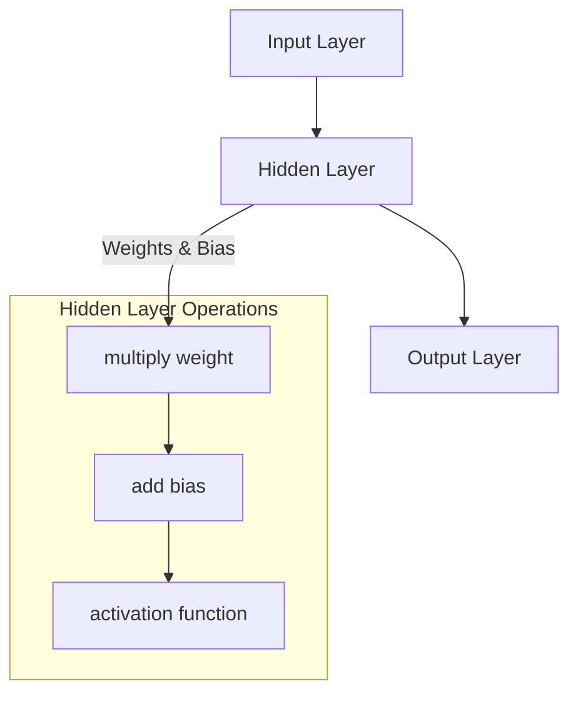

apply

1. multiply weight
2. add bias
3. activation function

when you leave cell you get weight, when you make it to the cel, you get bias

```mermaid
graph TD
    A[Input Layer] --> B[Hidden Layer]
    B --> C[Output Layer]
    
    subgraph Hidden Layer Operations
        D[multiply weight]
        E[add bias]
        F[activation function]
    end
    
    B -->|Weights & Bias| D --> E --> F
```

